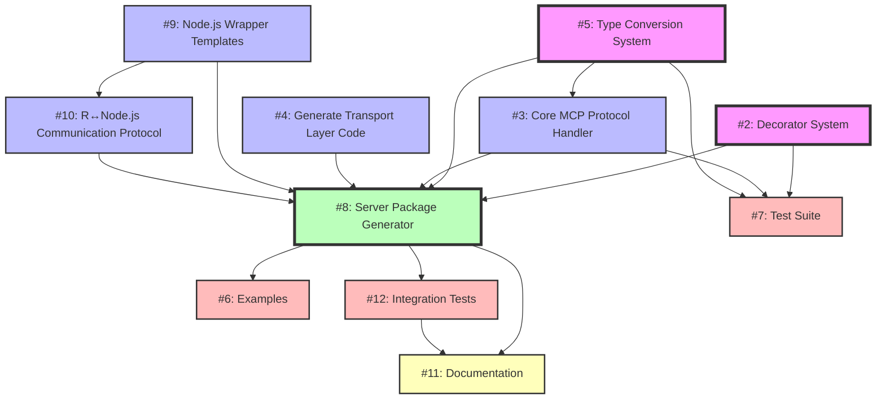

# mcpr Issues Dependency Graph and Implementation Order

## Dependency Graph



## Implementation Phases

### Phase 1: Foundation Layer (Parallel)
These can be developed independently and in parallel:

- **#2: Decorator System** ⚡
  - Parse roxygen2-style decorators
  - Extract function metadata
  - No dependencies
  
- **#5: Type Conversion System** ⚡
  - R to JSON conversion
  - Handle special R types
  - No dependencies

### Phase 2: Protocol & Transport Layer (Parallel)
These depend on Phase 1 but can be developed in parallel with each other:

- **#3: Core MCP Protocol Handler** 
  - Depends on: #5 (Type Conversion)
  - Implements MCP protocol in R
  - Handles JSON-RPC communication
  
- **#9: Node.js Wrapper Templates** ⚡
  - No direct dependencies
  - Critical for stdio transport
  - Handles subprocess communication
  
- **#10: R↔Node.js Communication Protocol**
  - Depends on: #9 (Node.js templates)
  - Defines internal protocol between wrapper and R

### Phase 3: Transport Generation
- **#4: Generate Transport Layer Code**
  - Can start after #9 and #10 are partially complete
  - Generates appropriate transport code (stdio via Node.js, HTTP, WebSocket)

### Phase 4: Core Generator
- **#8: Server Package Generator** 🎯
  - Depends on: #2, #3, #4, #5, #9, #10
  - This is the main deliverable
  - Integrates all components

### Phase 5: Testing & Examples (Parallel)
These can begin once #8 is partially complete:

- **#6: Examples**
  - Depends on: #8
  - Create example servers
  - Documentation of usage patterns
  
- **#7: Test Suite** ⚡
  - Can start early (unit tests for #2, #3, #5)
  - Integration tests depend on #8
  
- **#12: Integration Tests**
  - Depends on: #8
  - End-to-end testing with Claude Desktop
  - Cross-platform verification

### Phase 6: Documentation
- **#11: Documentation**
  - Depends on: #8, #12
  - Architecture explanation
  - User guides and migration paths

## Optimal Implementation Order

### Week 1-2: Foundation Sprint
1. Start #2 (Decorator System) and #5 (Type Conversion) in parallel
2. Begin #7 (Test Suite) for unit tests of #2 and #5
3. Start #9 (Node.js Wrapper Templates) independently

### Week 3-4: Protocol Sprint  
1. Implement #3 (MCP Protocol Handler) using completed #5
2. Define #10 (R↔Node.js Protocol) using #9 templates
3. Continue #7 (Test Suite) for protocol components

### Week 5: Transport Sprint
1. Implement #4 (Transport Layer Generation)
2. Integrate with #9 and #10 for stdio transport
3. Add HTTP and WebSocket transport options

### Week 6-7: Generator Sprint
1. Implement #8 (Server Package Generator) - main integration
2. This brings together all previous components
3. Begin #6 (Examples) as #8 becomes functional

### Week 8: Quality Sprint
1. Complete #12 (Integration Tests)
2. Finalize #6 (Examples) 
3. Complete #7 (Test Suite) with full integration tests

### Week 9: Documentation Sprint
1. Write #11 (Documentation)
2. Polish examples and tests
3. Prepare for release

## Critical Path

The critical path (longest dependency chain) is:
```
#5 → #3 → #8 → #12 → #11
```

However, #8 (Server Package Generator) is the convergence point that depends on almost everything, making it the most critical component.

## Parallelization Opportunities

**Maximum parallel teams: 3**
- Team 1: #2 (Decorators) + #7 (Tests)
- Team 2: #5 (Types) + #3 (Protocol) 
- Team 3: #9 (Node.js) + #10 (Communication)

## Risk Mitigation

1. **#9 is critical** - Without Node.js wrapper, stdio transport won't work
2. **#8 is complex** - Integrates everything, needs careful planning
3. **#12 is important** - Real-world testing with Claude Desktop is essential

## Notes

- ⚡ = Can start immediately
- 🎯 = Critical convergence point
- Dependencies shown are hard dependencies; soft dependencies (like documentation needing examples) are not shown
- The Node.js wrapper requirement (#9) is non-negotiable due to R's subprocess limitations